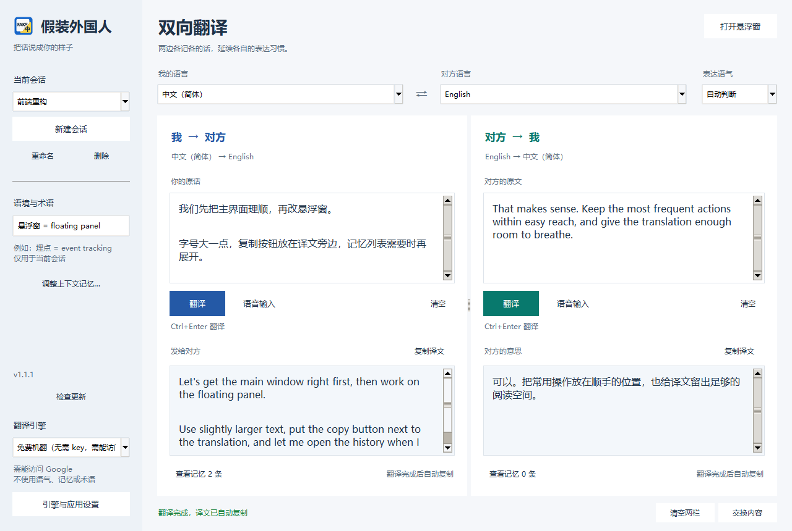
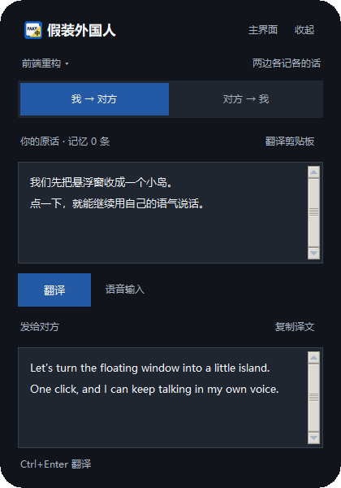

# 假装外国人翻译器 · Pretend Foreigner Translator

跟 Claude / GPT 聊天时用的**双向翻译工具**。

你说中文，它译成自然地道的英文发过去；对方回英文，它译成中文给你看。
**两条记忆线分开** —— 你的口语不会被对方的书面语带跑，对方的正式腔也不会被你的"哈哈"污染。

**但不是完全隔离。** 每条线还会带上**对方最近 2 条**（`crossMemoryDepth`，在「调整上下文记忆」里可以调），
**只用来解指代** —— 你说"那个先不用了"，这个"那个"指的是对方刚说的哪一句。
提示词里这两块是分开的:对方那几条只许用来定位指代，**不许抄用词、不许改语域**。

> 诚实说明:这个机制目前只在合成用例里试过（中→英/日/法/俄/德），没能测出明显差别。
> 原因不是它没用，而是**合成用例里造不出足够的真实场景** ——
> "那个""它"这类指代，得别人真的先说过一句才存在，靠几句人写的对话凑不齐。
> 要等实际使用中积累到翻错指代的案例，才能判断它到底管不管用。

```
我 → 对方   中文（简体）→ English      casual     ← 你说的话，记你自己的用词
对方 → 我   English → 中文（简体）      precise    ← 对方的话，记对方的术语
```

---

## 下载与安装

**Windows 专用。** 两种装法，功能完全一样：

> **下载页：https://github.com/NeoHotaru/pretend-foreigner-translator/releases**

| 包 | 大小 | 说明 |
|---|---|---|
| **安装包** `pretend-foreigner-setup-1.1.1.exe` | 约 202 MiB | 双击安装。向导里可以改安装目录（默认在当前用户的 `%LOCALAPPDATA%\Programs`，**那一页会显示各盘剩余空间**，C 盘紧就当场改）。带开始菜单、桌面快捷方式、卸载器。 |
| **便携版** `pretend-foreigner-portable-1.1.1.zip` | 约 236 MiB | 解压到任意位置，双击里面的 `pretend-foreigner.exe`。不写注册表、不装服务。 |

两个包**都已经内含 228 MB 的语音识别模型**，装完就能用语音。
（只有从源码运行才需要自己下模型，见下面的「依赖」。）

> **首次运行会被 Windows 拦一下。** 程序没有代码签名证书，SmartScreen 会显示
> "未知发布者"。点【更多信息】→【仍要运行】即可。个别杀软可能直接隔离文件，
> 那就先把它加进白名单再运行。

**配置和会话不会写在程序目录里** —— 它们在 `%APPDATA%\pretend-foreigner\`。
所以装到哪个盘、以后怎么更新，你的设置和会话都不会丢。

### 安装版自动更新

从 **v1.1.1** 起，安装版启动后检查 GitHub 最新正式版本，并在后台下载安装包。
下载完成会显示「重启并更新」：点击后保存会话、退出旧程序、覆盖实际安装目录，并打开新版。
安装标识与桌面快捷方式保持，配置和会话仍保存在用户数据目录。

「设置 → 软件更新」可以分别关闭启动检查和自动下载；也可以在侧栏手动检查或取消下载。
翻译或录音正在进行时不会开始安装。下载包会核对 GitHub 的 SHA-256 与文件大小，失败可重试。

**v1.0.5 / v1.1.0 需要先手动安装一次 v1.1.1**，才具备自动下载与覆盖能力。
便携版和源码通过「下载新版」打开下载页，不会自动覆盖机器上另一份安装版。

---

## 它解决什么问题

直接拿翻译软件跟 AI 聊天有两个毛病：

1. **翻译腔。** 一句"今天累死了，不想干活了"译成
   "Today I am extremely tired and do not wish to work" —— 对方一眼看出你不在说人话。
   这个工具会判语气：闲聊就译成 "ugh today totally wiped me"，任务就译成规整的英文。
2. **记忆串味。** 对方写了一大段正式的技术评价，你回一句"行，那就这样"——
   如果共用一份上下文，那份英文会把你这句短中文也拉成书面语。

所以分了两条线，各自只记自己那一侧的原文和译文。
（但每栏翻译时会**额外看对方最近几条**，只为了搞清"那个""这样"指的是什么。）

---

## 快速开始

```bash
python src/translate_app.py            # 有控制台，方便看报错
wscript run/启动假装外国人.vbs          # 平时用这个，无控制台
```

第一次打开会让你选一个翻译引擎：

- **免费机翻** —— 不用注册、不用填 key，装完就能用。
  代价是没有语气判定、不记上下文、一句话一句话直译；国内需要能访问 Google。
- **用你自己的 API Key** —— 质量明显更好。
  推荐 DeepSeek（国内直连，大约 ¥1 / 百万字），向导里有直达链接。

选完之后可以在「设置」里随时改。

> ⚠️ **向导里那一片是灰的，不是坏了。** 默认选中「免费机翻」时，下面的
> 「服务商 / Base URL / API Key / 模型」以及「读取模型 / 测试连通 / 去哪里拿 Key」
> 都【故意】不可点 —— 免费机翻用不到它们。
> 点上方的第二项「用我自己的 API Key」，它们立刻就会亮。

### 依赖

```
Python 3.10+  ✓ tkinter  ✓ requests  ✓ numpy  ✓ scipy
sounddevice                  ← 语音输入（可选）
sherpa-onnx + onnxruntime    ← 语音识别（可选，纯 CPU 就够）
```

```bash
pip install requests numpy scipy sounddevice sherpa-onnx onnxruntime
```

**语音识别是可选的。** 不装 sherpa-onnx 的话，翻译和悬浮窗照常用，只是「🎤 说话」会报错。

语音模型（228 MB）**不在 git 仓库里**（`.gitignore` 排除了它），要单独下。
从源码运行就得自己下；上面那两个发行包已经内含，不用管这一段：

```
https://github.com/k2-fsa/sherpa-onnx/releases/download/asr-models/sherpa-onnx-sense-voice-zh-en-ja-ko-yue-int8-2024-07-17.tar.bz2
```

解压到 `models/` 下面即可。也可以放别处，用环境变量指过去：

```bash
set PFT_MODEL_DIR=D:\somewhere\sherpa-onnx-sense-voice-...
```

---

## 界面

**主窗口**（两栏并排，可拖分栏线）



会话、语境/术语和翻译引擎放在左侧；语言与表达语气在编辑区上方。
两侧分别输入、翻译，译文旁边可以复制，翻译完成也会自动复制。
点「查看记忆」打开独立历史窗口，可双击回填原文、多选删除或清空。
「调整上下文记忆」设置带入条数、字数上限和参照对方的条数。

字号、布局与设计参考见 [界面设计说明](docs/UI_DESIGN.md)。截图中的对话是示例内容。

**悬浮窗**（`Win+Alt+O` 开合）—— 跟浏览器并排时用这个

默认只显示一个可以拖动的小胶囊，点击后展开翻译面板。
「收起」、Esc 或点击面板之外，会回到胶囊；原稿与译文不会清空。




胶囊与面板标题栏都可拖动；「主界面」返回大窗口。
胶囊右键菜单可隐藏悬浮岛或调整透明度。会话菜单、方向切换与剪贴板翻译都保留。
录音和翻译可以在胶囊状态继续，完成后显示「已复制」。
快捷键翻译剪贴板会直接展开，Windows 关闭动画时开合也直接完成。

### 快捷键

| 键 | 作用 |
|---|---|
| `Win+Alt+O` | 显示 / 隐藏悬浮窗（全局，其它程序里也能按） |
| `Win+Alt+V` | 翻译剪贴板内容 |
| `Ctrl+Enter` | 在某一栏里翻译 |
| `Esc` | 优先取消录音；未录音时收起悬浮面板 |
| `Tab` / `Shift+Tab` | 在编辑区和操作控件之间前进 / 返回 |
| `Ctrl+A` / `Ctrl+C` | 在只读译文中全选 / 复制 |

---

## 用到的技术

| | |
|---|---|
| 翻译 | DeepSeek / 任何 OpenAI 兼容接口 / Google 免费端点 |
| 语音识别 | [sherpa-onnx](https://github.com/k2-fsa/sherpa-onnx) + [SenseVoiceSmall](https://github.com/QwenAudio/SenseVoice)（中文 CER 7.81%，比 Whisper 好约 3 倍） |
| 界面 | tkinter |
| 音频 | sounddevice |

**中文识别为什么不用 Whisper**：同一批音频实测，SenseVoice 平均 CER 5.9%，
faster-whisper base 24.8%，而且 Whisper 会把"日志"听成"日质"、还会输出繁体。

---

## 目录

```
src/translator_core.py   后端核心（不 import tkinter）
src/translate_app.py     主窗口
src/overlay.py           悬浮窗 + 全局快捷键
src/voice_input.py       录音 + 识别子进程客户端
src/asr_worker.py        ASR 子进程
src/ui_kit.py            共用绘制零件
src/setup_wizard.py      首次运行向导
docs/CORE_API.md         后端接口文档（想换前端读这个）
selftest.py              一条命令运行后端、语音与界面回归
```

---

## 自检

```bash
python selftest.py             # 全部回归，约 20 秒
python selftest.py --offline   # 跳过联网/模型/界面，约 1 秒
python artifacts/ui-refresh/check_interactions.py  # 沙箱界面交互，不发网络请求
python artifacts/island-refresh/check_island.py    # 胶囊开合、拖动、焦点与后台翻译
python tests/test_updates.py                      # 下载校验、缓存、取消与安装目录
python tests/check_update_ui.py                    # 后台下载、重试、保存与重启交接
```

改完代码先跑这个，它不依赖具体界面实现，能立刻分清是后端坏了还是前端坏了。

---

## 隐私

- **不带任何预置 API Key。** 首次运行必须自己选引擎。
- 翻译请求直接发给你选定的服务商（或 Google 免费端点），本项目不经过任何中间服务器。
- **语音识别在本机跑**，音频不出机器。
- 配置和会话存在 `%APPDATA%\pretend-foreigner\`（`pretend_foreigner.config.json` /
  `.sessions.json`），**不在程序目录里** —— 装到哪、怎么更新，设置都不丢。
  前者含明文 API Key，别提交到 git（`.gitignore` 已排除）。
- 程序**不会去翻别处的凭据**。它只认一个属于本项目自己的环境变量 `PFT_API_KEY`；
  不设它就走首次运行向导，和你自己机器上的行为一样。
